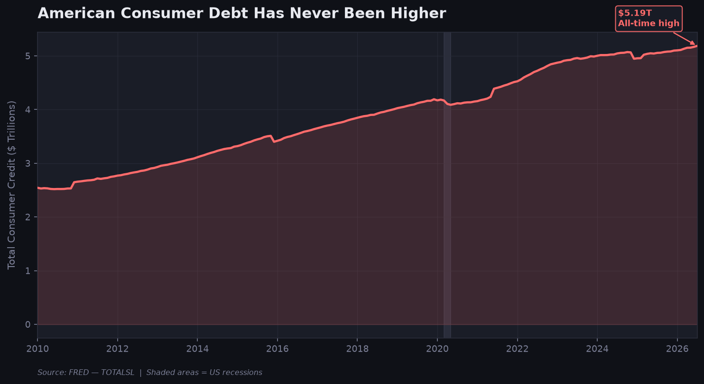
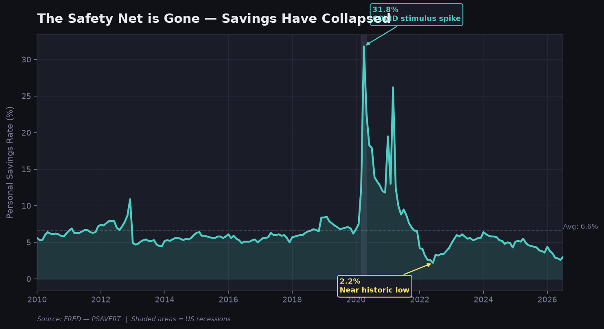
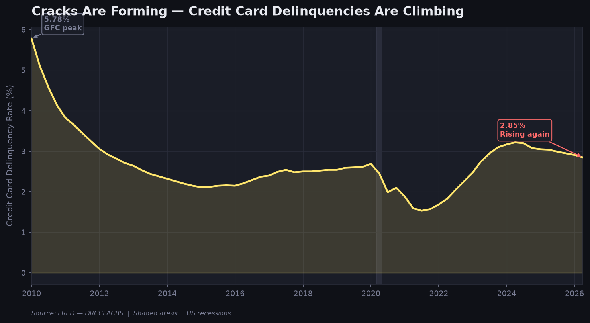

# The American Consumer Is Running Out of Road

 The story uses three FRED datasets to trace how American consumer finances have deteriorated — from record debt, to vanishing savings, to rising delinquencies.

---

## Tech Stack

| Tool | Purpose |
|---|---|
| Python 3.13 | Core language |
| `requests` | Pull CSV data from FRED |
| `pandas` | Data loading, cleaning, resampling |
| `matplotlib` | Chart building and PDF export |

---

## Project Structure

```
DS/
├── fetch_data.py         # Pulls FRED data and saves CSVs
├── charts.py             # Builds 3 charts and exports PDF + PNGs
├── data/
│   ├── consumer_debt.csv
│   ├── savings_rate.csv
│   ├── delinquency_rate.csv
│   └── recession.csv
└── output/
    ├── chart1_consumer_debt.png
    ├── chart2_savings_rate.png
    ├── chart3_delinquency.png
    └── consumer_stress_story.pdf
```

---

## Data Sources

All data is pulled from [FRED (Federal Reserve Bank of St. Louis)](https://fred.stlouisfed.org/) — no API key required.

| Series ID | Description | Frequency |
|---|---|---|
| `TOTALSL` | Total Consumer Credit Outstanding | Monthly |
| `PSAVERT` | Personal Savings Rate | Monthly |
| `DRCCLACBS` | Credit Card Delinquency Rate | Quarterly |
| `USREC` | US Recession Indicator | Monthly |

Date range: **January 2010 – present**

---

## How to Run

**1. Install dependencies**
```bash
pip install requests pandas matplotlib
```

**2. Fetch the data**
```bash
python fetch_data.py
```
Saves 4 CSV files to `/data/`.

**3. Build the charts and PDF**
```bash
python charts.py
```
Saves 3 PNGs and the full PDF to `/output/`.

---

## Output

### `consumer_stress_story.pdf`
A multi-page PDF containing:
- Cover page with story title
- Chart 1 + written description
- Chart 2 + written description
- Chart 3 + written description

### PDF

📄 [consumer_stress_story.pdf](./output/consumer_stress_story.pdf) — full submission with cover page, charts, and written descriptions.

### Charts

**Chart 1 — Consumer Debt at an All-Time High**



**Chart 2 — The Savings Safety Net Has Collapsed**



**Chart 3 — Cracks Are Forming: Delinquencies Are Rising**



---

## The Story

```
Chart 1  →  Consumer debt has hit an all-time high
Chart 2  →  The savings buffer has nearly disappeared
Chart 3  →  Credit card delinquencies are rising
```


